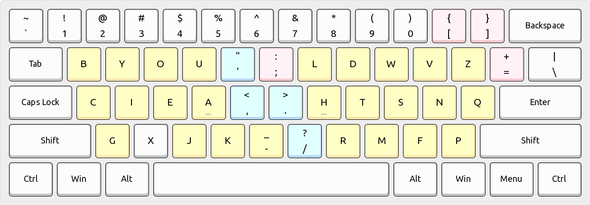
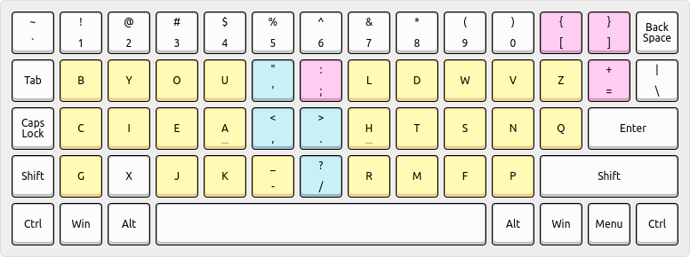

[Arno's Engram]: https://engram.dev

# Engrammer - [Arno's Engram] layout for programmers

This is a programmer-friendly variant of [Arno's Engram] 2.0 keyboard
layout that helps maintain cross-proficiency with standard keyboards:

* Shifted pairs are standard (e.g. quotes don't shift to parentheses).
* Semicolon is placed relative to comma and period just like standard.
* Equals and square brackets are placed near their standard locations.

In addition, application shortcuts that assume standard shifted pairs,
such as Control-Equals for the "zoom in" operation, now work properly.

To illustrate the differences between this layout, Engram, and QWERTY:

>*Legend:* Gold is [Arno's Engram]; Blue is Engram-like; Pink is new.
>
>
>
>     `~ 1! 2@ 3# 4$  5%  6^  7& 8* 9( 0) [{ ]}
>        bB yY oO uU  '"  ;:  lL dD wW vV zZ =+ \|
>        cC iI eE aA  ,<  .>  hH tT sS nN qQ
>        gG xX jJ kK  -_  /?  rR mM fF pP

For example, here is my split ortholinear keyboard using this layout:

>
>

## Linux setup

Install:

    cd linux/
    sudo make install
    echo Now restart your graphical session.

Activate:

    setxkbmap -layout us    -variant engrammer         # one layout; no switch
    setxkbmap -layout us,us -variant engrammer,basic   # dual layout switching

Repair (e.g. whenever a system-wide XKB package upgrade reverts installation):

    cd linux/
    sudo make reinstall
    echo Now restart your graphical session.

Uninstall:

    cd linux/
    sudo make uninstall
    echo Now restart your graphical session.

## Windows setup

You can [download a pre-built installation package](
  https://github.com/sunaku/engrammer/releases/download/windows/engrammer.zip
) or build one yourself, like this:

1. Install the official _Microsoft Keyboard Layout Creator_ app: [MSKLC version 1.4](
  https://www.microsoft.com/en-us/download/details.aspx?id=102134
).

2. Launch the MSKLC app and open up the `windows\engrammer.klc` source file.

3. From the "Project" menu, select the "Build DLL and Setup Package" action.

4. Open the resulting build directory and run the `setup.exe` installer file.

## License

Released under the same terms as [Arno's Engram]:

> MIT License
>
> Copyright 2021 Arno Klein
>
> Permission is hereby granted, free of charge, to any person obtaining a copy
> of this software and associated documentation files (the "Software"), to deal
> in the Software without restriction, including without limitation the rights
> to use, copy, modify, merge, publish, distribute, sublicense, and/or sell
> copies of the Software, and to permit persons to whom the Software is
> furnished to do so, subject to the following conditions:
>
> The above copyright notice and this permission notice shall be included in
> all copies or substantial portions of the Software.
>
> THE SOFTWARE IS PROVIDED "AS IS", WITHOUT WARRANTY OF ANY KIND, EXPRESS OR
> IMPLIED, INCLUDING BUT NOT LIMITED TO THE WARRANTIES OF MERCHANTABILITY,
> FITNESS FOR A PARTICULAR PURPOSE AND NONINFRINGEMENT. IN NO EVENT SHALL THE
> AUTHORS OR COPYRIGHT HOLDERS BE LIABLE FOR ANY CLAIM, DAMAGES OR OTHER
> LIABILITY, WHETHER IN AN ACTION OF CONTRACT, TORT OR OTHERWISE, ARISING FROM,
> OUT OF OR IN CONNECTION WITH THE SOFTWARE OR THE USE OR OTHER DEALINGS IN THE
> SOFTWARE.
